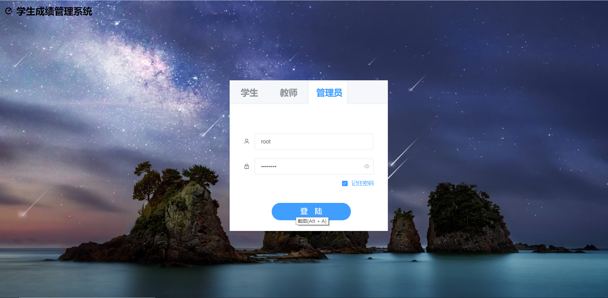
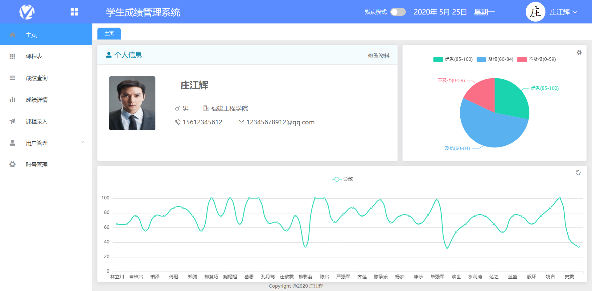
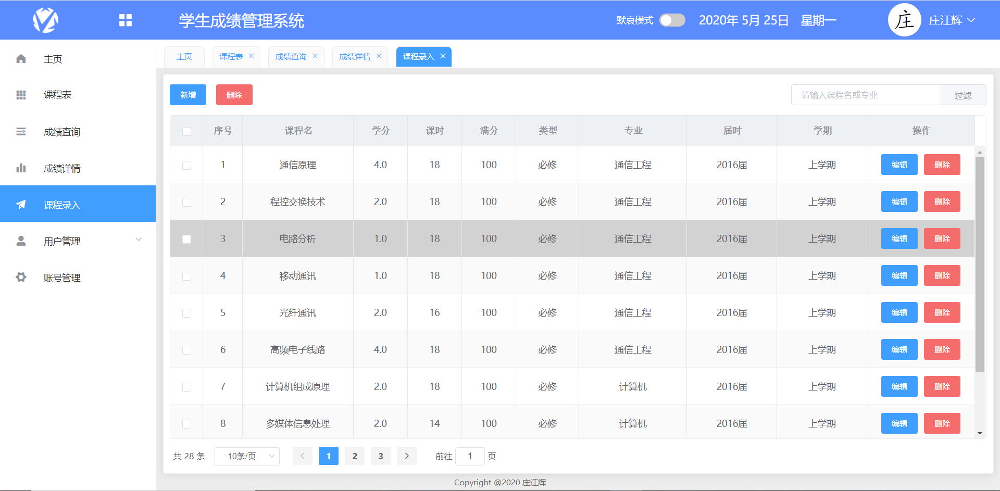
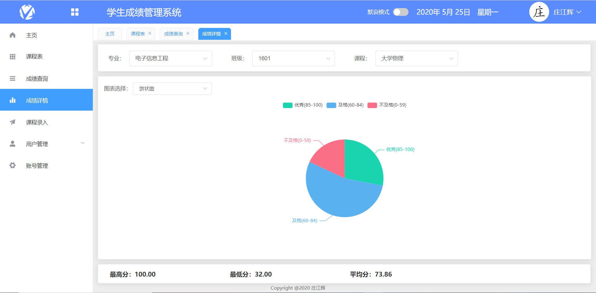
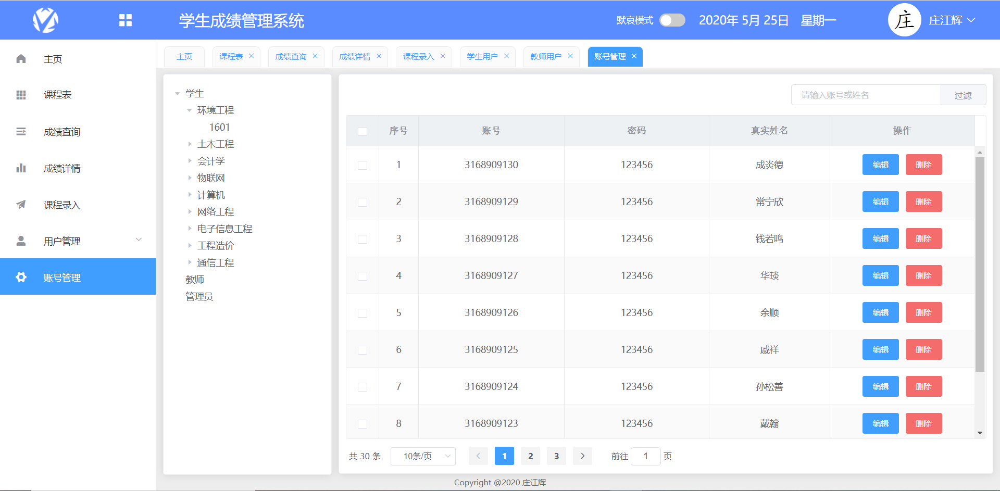
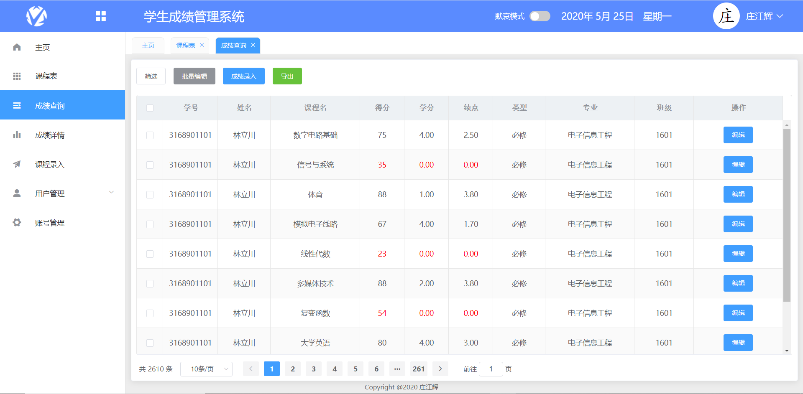
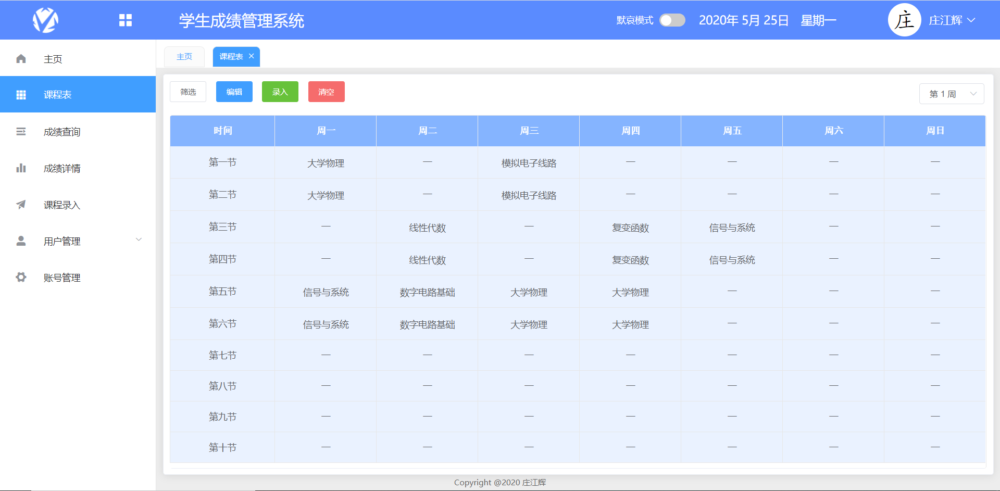
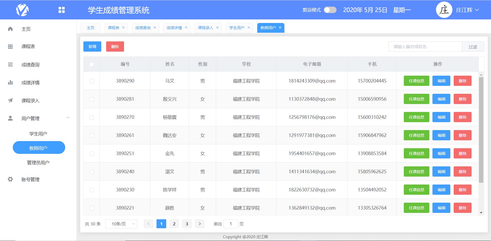

# 14-学生成绩管理系统

常年接毕设项目，如需完整代码或者项目部署工作+v: Ai1763591756

## 后端  

    1. idea 打开项目，等待自动下载依赖完成；  
    2.（非必须）idea 打开 File -> Setting -> Build, Execution, Deployment -> Build Tools -> Maven;  
    Maven home directory 选项  导入 maven 文件;  
## 启动  
    生产环境：  
       浏览器运行 http://localhost:8443/;  
    开发环境：  
        进入 前端目录 sms, 执行;  
        1. npm install  下载依赖;  
        2. npm run dev   启动;  
## 数据库：  
    根目录下的 student_mis.sql, 直接导入即可;  
    可在 application.properties 文件下更改数据库账号密码，默认为： 账号：root， 密码：password;  

​        
​        
